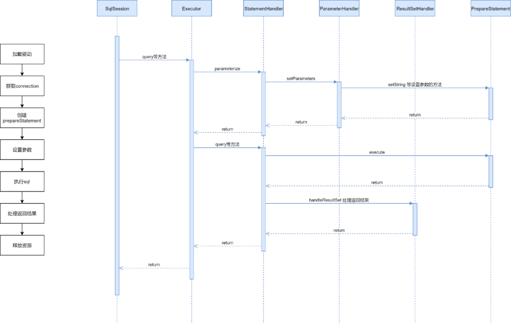

# MyBatis加解密插件

## MyBatis插件简介

MyBatis 预留了 `org.apache.ibatis.plugin.Interceptor`
接口，通过实现该接口，我们能对MyBatis的执行流程进行拦截，接口的定义如下:

```java
public interface Interceptor {

    Object intercept(Invocation invocation) throws Throwable;

    Object plugin(Object target);

    void setProperties(Properties properties);
}
```

其中有三个方法:

- **【intercept】**：插件执行的具体流程，传入的Invocation是MyBatis对被代理的方法的封装。
- **【plugin】**：使用当前的Interceptor创建代理，通常的实现都是 `Plugin.wrap(target, this)`
  ，wrap方法内使用 `jdk` 创建动态代理对象。
- **【setProperties】**：参考下方代码，在MyBatis配置文件中配置插件时可以设置参数，在`setProperties`函数中调用
  `Properties.getProperty("param1")` 方法可以得到配置的值。

```pom
<plugins>
    <plugin interceptor="com.xx.xx.xxxInterceptor">
        <property name="param1" value="value1"/>
    </plugin>
</plugins>
```

在实现intercept函数对MyBatis的执行流程进行拦截前，我们需要使用@Intercepts注解指定拦截的方法。

```java
@Intercepts({@Signature(type = Executor.class, method = "update", args = {MappedStatement.class,
        Object.class}),
        @Signature(type = Executor.class, method = "query", args = {MappedStatement.class,
                Object.class, RowBounds.class, ResultHandler.class})})
```

参考上方代码，我们可以指定需要拦截的类和方法。当然我们不能对任意的对象做拦截，MyBatis件可拦截的类为以下四个。

```
1. Executor
2. StatementHandler
3. ParameterHandler
4. ResultSetHandler
```

## Spring-MyBatis执行流程

（1）Spring通过`sqlSessionFactoryBean`创建`sqlSessionFactory`，
在使用`sqlSessionFactoryBean`时，我们通常会指定`configLocation`和`mapperLocations`，
来告诉`sqlSessionFactoryBean`去哪里读取配置文件以及去哪里读取mapper文件。
（2）得到配置文件和mapper文件的位置后，
分别调用`XmlConfigBuilder.parse()`和`XmlMapperBuilder.parse()`创建`Configuration`和`MappedStatement`
，
`Configuration`类顾名思义，存放的是MyBatis所有的配置，而`MappedStatement`类存放的是每条SQL语句的封装，
`MappedStatement`以map的形式存放到`Configuration`对象中，key为对应方法的全路径。
（3）Spring通过`ClassPathMapperScanner`扫描所有的Mapper接口，为其创建`BeanDefinition`
对象，但由于他们本质上都是没有被实现的接口，
所以Spring会将他们的`BeanDefinition`的`beanClass`属性修改为`MapperFactoryBean`。
（4）`MapperFactoryBean`也实现了`FactoryBean`接口，
Spring在创建Bean时会调用`FactoryBean.getObject()`方法获取Bean，
最终是通过`mapperProxyFactory`的`newInstance`方法为mapper接口创建代理，
创建代理的方式是JDK，最终生成的代理对象是`MapperProxy`。
（5）调用mapper的所有接口本质上调用的都是`MapperProxy.invoke`方法，内部调用`sqlSession`
的`insert/update/delete`等各种方法。

```
MapperMethod.java
public Object execute(SqlSession sqlSession, Object[] args) {
  Object result;
  if (SqlCommandType.INSERT == command.getType()) {
    Object param = method.convertArgsToSqlCommandParam(args);
    result = rowCountResult(sqlSession.insert(command.getName(), param));
  } else if (SqlCommandType.UPDATE == command.getType()) {
    Object param = method.convertArgsToSqlCommandParam(args);
    result = rowCountResult(sqlSession.update(command.getName(), param));
  } else if (SqlCommandType.DELETE == command.getType()) {
    Object param = method.convertArgsToSqlCommandParam(args);
    result = rowCountResult(sqlSession.delete(command.getName(), param));
  } else if (SqlCommandType.SELECT == command.getType()) {
    if (method.returnsVoid() && method.hasResultHandler()) {
      executeWithResultHandler(sqlSession, args);
      result = null;
    } else if (method.returnsMany()) {
      result = executeForMany(sqlSession, args);
    } else if (method.returnsMap()) {
      result = executeForMap(sqlSession, args);
    } else {
      Object param = method.convertArgsToSqlCommandParam(args);
      result = sqlSession.selectOne(command.getName(), param);
    }
  } else if (SqlCommandType.FLUSH == command.getType()) {
      result = sqlSession.flushStatements();
  } else {
    throw new BindingException("Unknown execution method for: " + command.getName());
  }
  if (result == null && method.getReturnType().isPrimitive() && !method.returnsVoid()) {
    throw new BindingException("Mapper method '" + command.getName()
        + " attempted to return null from a method with a primitive return type (" + method.getReturnType() + ").");
  }
  return result;
}
```

（6）`SqlSession`可以理解为一次会话，`SqlSession`会从`Configuration`中获取对应的`MappedStatement`
，交给`Executor`执行。

```
DefaultSqlSession.java
@Override
public <E> List<E> selectList(String statement, Object parameter, RowBounds rowBounds) {
  try {
    // 从configuration对象中使用被调用方法的全路径，获取对应的MappedStatement
    MappedStatement ms = configuration.getMappedStatement(statement);
    return executor.query(ms, wrapCollection(parameter), rowBounds, Executor.NO_RESULT_HANDLER);
  } catch (Exception e) {
    throw ExceptionFactory.wrapException("Error querying database.  Cause: " + e, e);
  } finally {
    ErrorContext.instance().reset();
  }
}
```

（7）`Executor`会先创建`StatementHandler`，`StatementHandler`可以理解为是一次语句的执行。
（8）然后`Executor`会获取连接，具体获取连接的方式取决于`Datasource`的实现，可以使用连接池等方式获取连接。
（9）之后调用`StatementHandler.prepare`方法，对应到JDBC执行流程中的`Connection.prepareStatement`这一步。
（10）`Executor`再调用`StatementHandler`的`parameterize`方法，设置参数，对应到
JDBC执行流程的`StatementHandler.setXXX()`设置参数，内部会创建`ParameterHandler`方法。

```
SimpleExecutor.java
@Override
public <E> List<E> doQuery(MappedStatement ms, Object parameter, RowBounds rowBounds, ResultHandler resultHandler, BoundSql boundSql) throws SQLException {
  Statement stmt = null;
  try {
    Configuration configuration = ms.getConfiguration();
    // 创建StatementHandler，对应第7步
    StatementHandler handler = configuration.newStatementHandler(wrapper, ms, parameter, rowBounds, resultHandler, boundSql);
    // 获取连接，再调用conncetion.prepareStatement创建prepareStatement，设置参数
    stmt = prepareStatement(handler, ms.getStatementLog());
    // 执行prepareStatement
    return handler.<E>query(stmt, resultHandler);
  } finally {
    closeStatement(stmt);
  }
}
```

（11）再由`ResultSetHandler`处理返回结果，处理JDBC的返回值，将其转换为Java的对象。

## MyBatis插件的创建时机

在`Configuration`类中，我们能看到`newExecutor`、`newStatementHandler`、`newParameterHandler`
、`newResultSetHandler`这四个方法，插件的代理类就是在这四个方法中创建的，以StatementHandeler的创建为例：

```
Configuration.java
public StatementHandler newStatementHandler(Executor executor, MappedStatement mappedStatement, Object parameterObject, RowBounds rowBounds, ResultHandler resultHandler, BoundSql boundSql) {
  StatementHandler statementHandler = new RoutingStatementHandler(executor, mappedStatement, parameterObject, rowBounds, resultHandler, boundSql);
  // 使用责任链的形式创建代理
  statementHandler = (StatementHandler) interceptorChain.pluginAll(statementHandler);
  return statementHandler;
}
 
InterceptorChain.java
public Object pluginAll(Object target) {
  for (Interceptor interceptor : interceptors) {
    target = interceptor.plugin(target);
  }
  return target;
}
```

`interceptor.plugin`
对应到我们自己实现的interceptor里的方法，通常的实现是 `Plugin.wrap(target, this);` ，该方法内部创建代理的方式为JDK。

## MyBatis插件可拦截类选择



Mybatis本质上是对JDBC执行流程的封装。结合上图我们简要概括下Mybatis这几个可被代理类的职能。

- 【Executor】: 真正执行SQL语句的对象，调用`sqlSession`的方法时，本质上都是调用`executor`
  的方法，还负责获取`connection`，创建`StatementHandler`。
- 【StatementHandler】: 创建并持有`ParameterHandler`和`ResultSetHandler`对象，操作JDBC的`statement`
  与进行数据库操作。
- 【ParameterHandler】: 处理入参，将Java方法上的参数设置到被执行语句中。
- 【ResultSetHandler】: 处理SQL语句的执行结果，将返回值转换为Java对象。

对于入参的加密，我们需要在`ParameterHandler`调用`prepareStatement.setXXX()`
方法设置参数前，将参数值修改为加密后的参数，这样一看好像拦截`Executor/StatementHandler/ParameterHandler`
都可以。

但实际上呢？由于我们的并不是在原始字段上做加密，而是新增了一个加密后字段，这会带来什么问题？请看下面这条mapper.xml文件中加了加密后字段的动态SQL：

```xml

<select id="selectUserList" resultMap="BaseResultMap"
        parameterType="com.xxx.internet.demo.entity.UserInfo">
    SELECT
    *
    FROM
    `t_user_info`
    <where>
        <if test="phone != null">
            `phone` = #{phone}
        </if>
        <!--            明文字段-->
        <if test="secret != null">
            AND `secret` = #{secret}
        </if>
        <!--            加密后字段-->
        <if test="secretCiper != null">
            AND `secret_ciper` = #{secretCiper}
        </if>
        <if test="name">
            AND `name` = #{name}
        </if>
    </where>
    ORDER BY `update_time` DESC
</select>
```

可以看到这条语句带了动态标签，那肯定不能直接交给JDBC创建`prepareStatement`
，需要先将其解析成静态SQL，而这一步是在`Executor`在调用`StatementHandler.parameterize()`
前做的，由`MappedStatementHandler.getBoundSql(Object parameterObject)`
函数解析动态标签，生成静态SQL语句，这里的parameterObject我们可以暂时先将其看成一个Map，键值分别为参数名和参数值。

那么我们来看下用`StatementHandler`和`ParameterHandler`
做参数加密会有什么问题，在执行`MappedStatementHandler.getBoundSql`时，`parameterObject`
中并没有写入加密后的参数，在判断标签时必定为否，最后生成的静态SQL必然不包含加密后的字段，后续不管我们在`StatementHandler`
和`ParameterHandler`中怎么处理`parameterObject`，都无法实现入参的加密。

因此，<font color=red>在入参的加密上我们只能选择拦截`Executor`的`update`和`query`方法。</font>

## 方案实施

首先定义一个方法维度的注解。

```java
/**
 * 通过注解来表明，我们需要对那个字段进行加密
 */
@Target({ElementType.METHOD})
@Retention(RetentionPolicy.RUNTIME)
@Inherited
@Documented
public @interface TEncrypt {

    /**
     * 加密时从srcKey到destKey
     * @return
     */
    String[] srcKey() default {};

    /**
     * 解密时从destKey到srcKey
     * @return
     */
    String[] destKey() default {};
}
```

将该注解打在需要加解密的DAO层方法上。

```java
// UserMapper.java
public interface UserMapper {

    @TEncrypt(srcKey = {"secret"}, destKey = {"secretCiper"})
    List<UserInfo> selectUserList(UserInfo userInfo);
}
```

修改xxxMapper.xml文件

```xml

<mapper namespace="com.xxx.internet.demo.mapper.UserMapper">
    <resultMap id="BaseResultMap" type="com.xxx.internet.demo.entity.UserInfo">
        <id column="id" jdbcType="BIGINT" property="id"/>
        <id column="phone" jdbcType="VARCHAR" property="phone"/>
        <id column="secret" jdbcType="VARCHAR" property="secret"/>
        <!--        加密后映射-->
        <id column="secret_ciper" jdbcType="VARCHAR" property="secretCiper"/>
        <id column="name" jdbcType="VARCHAR" property="name"/>
    </resultMap>

    <select id="selectUserList" resultMap="BaseResultMap"
            parameterType="com.xxx.internet.demo.entity.UserInfo">
        SELECT
        *
        FROM
        `t_user_info`
        <where>
            <if test="phone != null">
                `phone` = #{phone}
            </if>
            <!--            明文字段-->
            <if test="secret != null">
                AND `secret` = #{secret}
            </if>
            <!--            加密后字段-->
            <if test="secretCiper != null">
                AND `secret_ciper` = #{secretCiper}
            </if>
            <if test="name">
                AND `name` = #{name}
            </if>
        </where>
        ORDER BY `update_time` DESCv
    </select>
</mapper>
```

做完上面的修改，我们就可以编写加密插件了

```java

@Intercepts({@Signature(type = Executor.class, method = "update", args = {MappedStatement.class,
        Object.class}),
        @Signature(type = Executor.class, method = "query", args = {MappedStatement.class,
                Object.class, RowBounds.class, ResultHandler.class})})
public class ExecutorEncryptInterceptor implements Interceptor {

    private static final ObjectFactory DEFAULT_OBJECT_FACTORY = new DefaultObjectFactory();

    private static final ObjectWrapperFactory DEFAULT_OBJECT_WRAPPER_FACTORY = new DefaultObjectWrapperFactory();

    private static final ReflectorFactory REFLECTOR_FACTORY = new DefaultReflectorFactory();

    private static final List<String> COLLECTION_NAME = Arrays.asList("list");

    private static final String COUNT_SUFFIX = "_COUNT";

    @Override
    public Object intercept(Invocation invocation) throws Throwable {

        // 获取拦截器拦截的设置参数对象DefaultParameterHandler
        final Object[] args = invocation.getArgs();
        MappedStatement mappedStatement = (MappedStatement) args[0];
        Object parameterObject = args[1];

        // id字段对应执行的SQL的方法的全路径，包含类名和方法名
        String id = mappedStatement.getId();
        String className = id.substring(0, id.lastIndexOf("."));
        String methodName = id.substring(id.lastIndexOf(".") + 1);

        // 分页插件会生成一个count语句，这个语句的参数也要做处理
        if (methodName.endsWith(COUNT_SUFFIX)) {
            methodName = methodName.substring(0, methodName.lastIndexOf(COUNT_SUFFIX));
        }

        // 动态加载类并获取类中的方法
        final Method[] methods = Class.forName(className).getMethods();

        // 遍历类的所有方法并找到此次调用的方法
        for (Method method : methods) {
            if (method.getName().equalsIgnoreCase(methodName) && method.isAnnotationPresent(
                    TEncrypt.class)) {

                // 获取方法上的注解以及注解对应的参数
                TEncrypt paramAnnotation = method.getAnnotation(TEncrypt.class);

                // 支持加密的操作，这里只修改参数
                if (parameterObject instanceof Map) {
                    List<String> paramAnnotations = findParams(method);
                    parameterMapHandler((Map) parameterObject, paramAnnotation,
                            mappedStatement.getSqlCommandType(), paramAnnotations);
                } else {
                    encryptParam(parameterObject, paramAnnotation,
                            mappedStatement.getSqlCommandType());
                }
            }
        }

        return invocation.proceed();
    }
}
```

加密的主体流程如下：

1. 判断本次调用的方法上是否注解了@TEncrypt。
2. 获取注解以及在注解上配置的参数。
3. 遍历parameterObject，找到需要加密的字段。
4. 调用加密方法，得到加密后的值。
5. 将加密后的字段和值写入parameterObject。

难点主要在`parameterObject`的解析，到了`Executor`这一层，`parameterObject`已经不再是简单的Object[]
，而是由`MapperMethod.convertArgsToSqlCommandParam(Object[] args)`
方法创建的一个对象，既然要对这个对象做处理，我们肯定得先知道它的创建过程。


参考上图`parameterObject`的创建过程，加密插件对`parameterObject`
的处理本质上是一个逆向的过程。如果是list，我们就遍历list里的每一个值，如果是map，我们就遍历map里的每一个值。

得到需要处理的Object后，再遍历Object里的每个属性，判断是否在`@TEncrypt`
注解的srcKeys参数中，如果是，则加密再设置到Object中。

## 问题挑战

### 分页插件自动生成count语句

业务代码里很多地方都用了 `com.github.pagehelper`
进行物理分页，参考下面的demo，在使用PageRowBounds时，pagehelper插件会帮我们获取符合条件的数据总数并设置到rowBounds对象的total属性中。

```java
PageRowBounds rowBounds=new PageRowBounds(0,10);
        List<User> list=userMapper.selectIf(1,rowBounds);
        long total=rowBounds.getTotal();
```

那么问题来了，表面上看，我们只执行了`userMapper.selectIf(1, rowBounds)`
这一条语句，而`pagehelper`是通过改写SQL增加`limit、offset`
实现的物理分页，在整个语句的执行过程中没有从数据库里把所有符合条件的数据读出来，那么`pagehelper`
是怎么得到数据的总数的呢？

答案是pagehelper会再执行一条`count语句`。先不说额外一条执行count语句的原理，我们先看看加了一条count语句会导致什么问题。

参考之前的selectUserList接口，假设我们想选择secret为某个值的数据，
那么经过加密插件的处理后最终执行的大致是这样一条语句 `"select * from t_user_info where secret_ciper = ? order by update_time limit ?, ?"`
。

但由于pagehelper还会再执行一条语句，而由于该语句并没有 `@TEncrypt`
注解，所以是不会被加密插件拦截的，最终执行的count语句是类似这样的: `"select count(*) from t_user_info where secret = ? order by update_time"`
。

可以明显的看到第一条语句是使用secret_ciper作为查询条件，而count语句是使用secret作为查询条件，会导致最终得到的数据总量和实际的数据总量不一致。

因此我们在加密插件的代码里对count语句做了特殊处理，由于pagehelper新增的count语句对应的mappedStatement的id固定以`"_COUNT"`
结尾，而这个id就是对应的mapper里的方法的全路径，举例来说原始语句的id是`"com.xxx.internet.demo.entity.UserInfo.selectUserList"`
，那么count语句的id就是`"com.xxx.internet.demo.entity.UserInfo.selectUserList_COUNT"`，去掉`"_COUNT"`
后我们再判断对应的方法上有没有注解就可以了。
